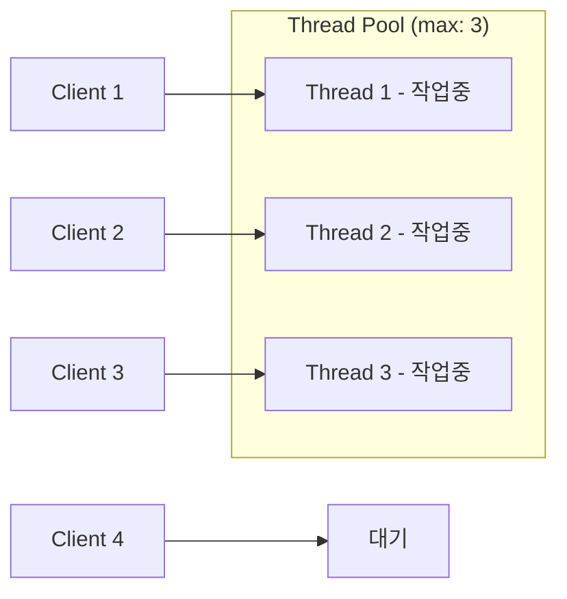
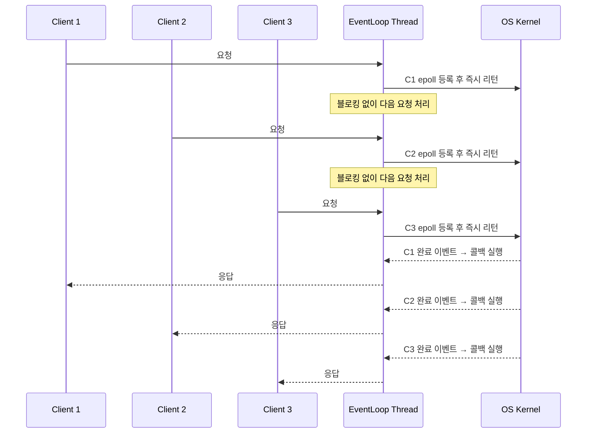

## I/O 병목 현상
서버의 CPU 사용률은 10%인데 메모리 사용량은 높고, 응답이 지연된다면 문제는 CPU가 아닌 I/O에 있을 가능성이 높다. 애플리케이션을 하나 만들어도 DB, 캐시 서버, 외부 API, 파일 시스템 등과의 통신이 대부분의 시간을 차지한다.  
이러한 I/O 병목 현상으로 인해서 CPU를 효율적으로 활용하지 못하게 되며 (대기 상태), 애플리케이션의 처리량이나 응답 시간이 저하될 수 있다.  

### I/O 바운드 vs CPU 바운드

애플리케이션 작업의 성격에 따라서 병목이 발생하는 지점이 다르다.
- CPU 바운드(CPU-bound): 작업 대부분의 시간을 CPU 연산에 소비하는 작업
  - 병목: CPU 성능이 처리 속도를 결정
  - 예) 이미지/영상 처리, 암호화/복호화, 머신러닝 연산, 대용량 데이터 정렬
- I/O 바운드(I/O-bound): 작업 대부분의 시간을 I/O 대기에 소비하는 작업
  - 병목: I/O 응답 대기 시간이 처리 속도를 결정
  - 예) DB 쿼리, HTTP API 호출, 파일 읽기/쓰기, 캐시 서버 조회

대부분의 백엔드 서비스는 I/O 바운드 성격을 띠며, 전체 처리 시간의 대부분이 I/O 대기에 소비된다. 이로 인해서 CPU는 대부분의 시간 동안 I/O 응답을 기다리며 아무 일도 하지 않는 대기 상태(blocking)에 머문다.

### 기본적인 해결책

기본적으로 I/O 병목 현상을 해결하기 위해서는 스레드 풀을 활용 또는 외부 서버의 처리 속도 개선 등이 필요하다.  
대부분의 애플리케이션의 경우 트래픽이 그렇게 많지 않기 때문에 위 방법들을 활용하여 I/O 병목 현상을 완화할 수 있다.

#### 스레드 풀
스레드 풀은 스레드를 미리 생성해두고 작업이 들어올 때마다 스레드를 할당 및 재사용을 통해서 스레드 생성 및 소멸 비용을 줄일 수 있다.  
특히 I/O 바운드 작업에서는 스레드가 I/O 대기 상태에 빠지게 되는 경우가 많기 때문에, CPU 코어 수보다 많은 스레드를 활용하여 I/O 대기 상태에 빠진 스레드가 있더라도 다른 스레드가 작업을 처리할 수 있도록 한다.  

하지만 이러한 스레드 풀 방식에도 근본적인 한계가 존재한다.
- **스레드 수의 한계**: OS 스레드는 생성 비용이 크고 메모리를 많이 소비 (JVM 기준 스레드 1개 = 약 1MB 스택)
- **컨텍스트 스위칭**: 스레드 수가 많아질수록 CPU가 스레드 전환에 소비하는 시간이 증가
- **스케일 아웃 비용**: 서버를 수평적으로 확장하여 처리량을 늘리게 될 경우 비용 증가

예를 들어 동시에 10000개의 요청을 처리해야 하는 경우, 스레드 풀에서 10000개의 스레드를 생성하는 것은 현실적으로 어렵다.

#### 외부 서버의 처리 속도 개선
외부 API의 경우 우리가 제어할 수 없는 경우가 많지만, DB나 캐시 서버의 경우에는 쿼리 최적화, 인덱스 추가, 캐싱 전략 개선 등을 통해서 처리 속도를 개선할 수 있다.  
이를 통해서 I/O 대기 시간을 줄이고, 애플리케이션의 응답 속도를 개선할 수 있다.  
DB나 캐시 서버의 처리 속도가 개선되더라도, 애플리케이션이 처리해야 하는 요청 수가 많아질수록 I/O 병목 현상은 여전히 발생할 수 있기 때문에 근본적인 해결책이 되지는 못한다.

### 어떻게 해야할까?
동시 처리해야하는 요청 수가 많아지며 I/O 병목 현상이 심각해지는 경우 기본적인 해결책만으로는 한계가 존재하다.  
이를 해결하기 위해서는 Non-blocking I/O, 가상 스레드와 같은 새로운 접근 방식을 통해서 CPU 대기 시간을 줄이고, 메모리 사용량을 최적화 하여 높은 처리량을 달성할 수 있도록 해야 한다.  

- **논블로킹 I/O(Non-Blocking I/O)**: 스레드가 I/O 응답을 기다리는 동안 블로킹되는 대신, 이벤트 루프 방식으로 하나의 스레드가 여러 I/O 작업을 처리한다. 적은 스레드로 높은 처리량을 달성할 수 있다.
- **가상 스레드(Virtual Thread)**: OS 스레드 대신 JVM이 직접 관리하는 경량 스레드를 활용하여, 스레드 생성 비용과 메모리 문제를 해결한다. 기존 동기식 코드 구조를 유지하면서도 높은 동시성을 달성할 수 있다는 것이 특징이다. 

| | 스레드 수 한계 | 컨텍스트 스위칭| 코드 복잡도 | 
|------------------|------------------|------------------|------------------|
| 스레드 풀 | 해결 안됨 | 해결 안됨 | 낮음 |
| 논블록킹 I/O | 해결 | 해결 | 높음 |
| 가상 스레드 | 해결 | 부분 완화 | 낮음 |

## 논블록킹 I/O (Non-blocking I/O)
논블록킹 I/O는 스레드가 I/O 작업을 수행할 때, **_I/O 작업이 완료될 때까지 블로킹되는 대신, OS 커널에게 I/O 작업을 요청하고, I/O 작업이 완료되면 커널이 애플리케이션에게 알리는 방식_** 으로 동작한다.  
이를 통해서 하나의 스레드가 많은 I/O 작업을 처리할 수 있게 되며, CPU 대기 시간을 줄이고, 메모리 사용량을 최적화하여 높은 처리량을 달성할 수 있다.  

### 이벤트 루프 (Event Loop)
이벤트 루프는 논블로킹 I/O의 핵심 메커니즘으로, 스레드가 클라이언트 요청을 받으면 I/O 작업을 이벤트 루프에 등록하고, 이벤트 루프는 이를 OS 커널(epoll/kqueue)에 위임한다.
OS 커널이 실제 I/O를 처리하고 완료 이벤트를 통지하면, 이벤트 루프가 해당 콜백을 실행하여 응답을 반환한다.  
이 과정에서 스레드는 I/O 완료를 기다리며 블로킹되지 않기 때문에, 하나의 스레드가 동시에 수천 개의 연결을 처리할 수 있다.

이벤트 루프를 통해서 I/O 작업을 효율적으로 처리할, 이벤트 루프 스레드는 모든 클라이언트의 I/O 이벤트를 처리하기 때문에 블록킹 하는 코드를 작성하지 않는 것이 중요하다.  
- **CPU 바운드 작업**: 이미지 처리, 암호화 연산 같은 CPU 집약적인 작업이 실행되면, 해당 작업이 끝날 때까지 다른 모든 클라이언트의 이벤트 처리도 함께 멈춘다. 따라서 CPU 바운드 작업은 반드시 별도의 스레드에 위임하여 이벤트 루프 스레드가 I/O 이벤트 처리에 집중할 수 있도록 해야 한다.
- **블록킹 코드 작성**: 이벤트 루프 스레드에서 JDBC(동기 DB 드라이버), Thread.sleep(), 동기 파일 I/O 같은 블로킹 코드가 실행되면, 해당 스레드가 응답을 기다리는 동안 다른 모든 클라이언트의 이벤트 처리도 함께 멈춘다. 논블로킹 I/O의 이점을 살리려면 이벤트 루프 스레드 위에서는 블로킹 코드 실행을 피해야 한다.

> Netty와 같은 논블록킹 I/O 웹 서버 프레임워크는 하나 이상의 이벤트 루프를 활용하여 동시성을 극대화한다. 보통 CPU 코어 수에 맞춰서 이벤트 루프 스레드를 생성하며, 각 스레드는 수천 개의 클라이언트 연결을 처리할 수 있다.  

### 논블록킹 I/O의 한계
논블록킹 I/O는 I/O 병목 현상을 완화하는 데 효과적이지만, 다음과 같은 한계가 존재한다.
- **코드 복잡도 증가**: 콜백, Promise, async/await 등 비동기 프로그래밍 모델을 사용해야 하기 때문에, 기존 동기식 코드에 비해 코드 흐름을 추적하기 어렵고 에러 처리와 디버깅이 복잡해진다.
- **CPU 바운드 작업 부적합**: EventLoop Thread는 단 하나이기 때문에, 이 스레드에서 무거운 연산 작업이 실행되면 해당 작업이 끝날 때까지 다른 모든 클라이언트의 요청 처리가 멈춘다. CPU 바운드 작업은 반드시 별도의 스레드에 위임해야 하며 이로 인해서 코드 복잡도가 더욱 증가할 수 있다.
- **생태계 의존성**: 논블록킹 I/O의 이점을 온전히 활용하려면, 사용하는 라이브러리와 드라이버도 논블록킹 방식을 지원해야 한다. 동기 방식의 라이브러리를 EventLoop Thread에서 직접 호출하면 블로킹이 발생하여 전체 시스템 응답성이 저하된다.

## 가상 스레드 (Virtual Thread)
가상 스레드는 OS 스레드 대신 런타임 (JVM, Go 런타임 등)이 직접 관리하는 경량 스레드로, 런타임 레벨에서 스레드 스케줄링과 컨텍스트 스위칭을 처리한다.  
JVM으로 예를 들면 Java의 스레드는 OS 스레드와 1:1 매핑되는 전통적인 스레드 모델을 사용하기 때문에 스레드 생성 비용이 크고 메모리를 많이 소비한다. 반면 가상 스레드는 기존 스레드 모델보다 좀더 작은 단위로 나누어 관리하기 때문에, 빠르게 생성 및 소멸이 가능하며 메모리 사용량이 적기 때문에 기존 스레드보다 훨씬 많은 수의 스레드를 활용할 수 있다.  
이를 통해서 기존 동기식 코드 구조를 유지하면서도 높은 동시성을 달성할 수 있는 것이 큰 장점이다.