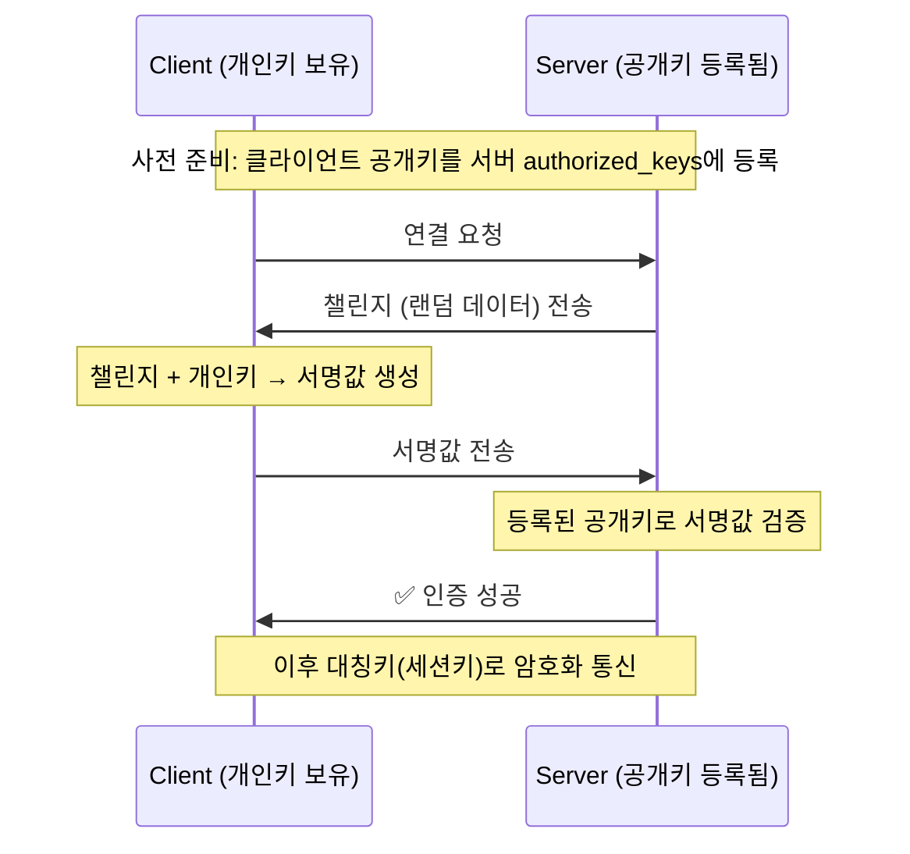
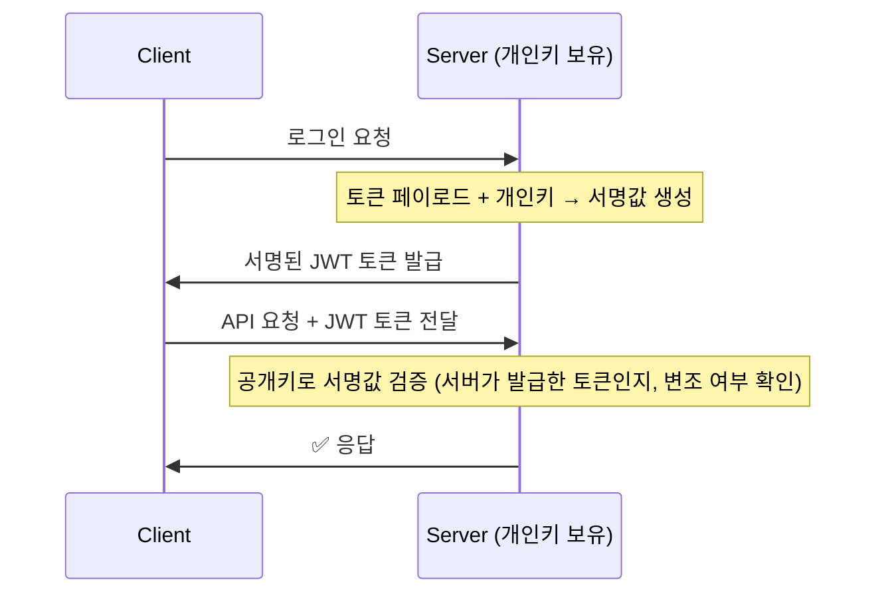
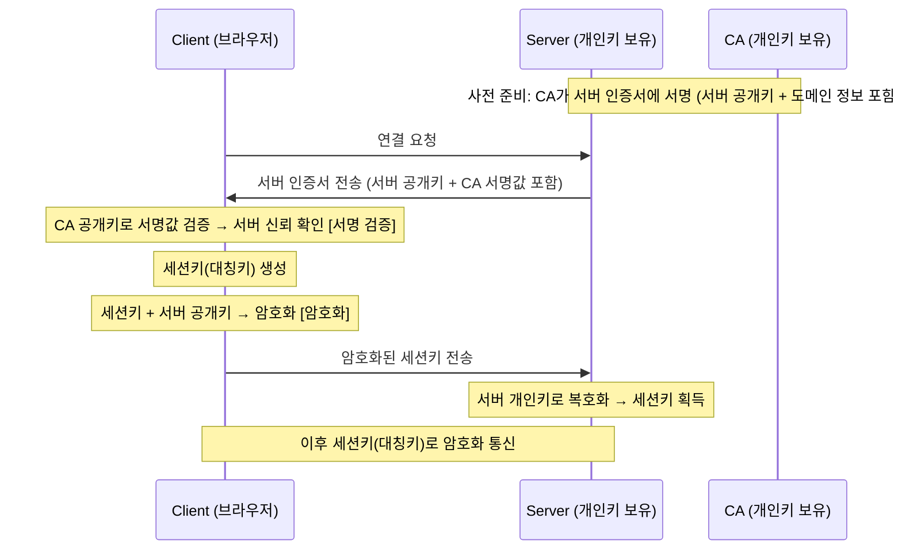

## 보안

## 암호화 (Encryption)
암호화는 **_데이터를 보호하는 기술_**로써, 해커거 데이터를 탈취하더라도 **_해당 데이터를 이해할 수 없도록 만드는 방법_**이다.  
예를 들어 사용자의 아이디와 패스워드를 데이터베이스에 저장했다고 가정했을때, 해커가 데이터베이스를 탈취하게 되면 해당 아이디와 패스워드를 그대로 사용할 수 있게 된다. 특히 아이디와 비밀번호 같은 경우 사용자가 여러 서비스에서 동일한 아이디와 비밀번호를 사용하는 경우가 많기 때문에, 해커는 탈취한 아이디와 비밀번호를 다른 서비스에서도 사용할 수 있게 된다.  
따라서 보안이 중요한 데이터는 반드시 암호화하여 저장해야 하며, 해커가 탈취하더라도 해당 데이터를 사용할 수 없도록 해야 한다.  
암호화는 단방향 암호화와 양방향 암호화로 나눌 수 있으며 암호화된 데이터를 복호화할 수 있는지 여부에 따라서 구분할 수 있다.  

### 단방향 암호화 (One-way Encryption)
단방향 암호화는 암호화된 데이터를 복호화할 수 없는 방식으로, 주로 해시(Hash) 함수를 사용하여 데이터를 암호화한다.  
예를 들어 사용자의 패스워드를 단방향 암호화하여 데이터베이스에 저장하는 경우, 해커가 데이터베이스를 탈취하더라도 해당 패스워드를 복호화할 수 없기 때문에, 해커는 해당 패스워드를 사용할 수 없게 된다.  

#### 해시 (Hash)
해시 함수는 임의의 길이의 입력 데이터를 **_고정된 길이의 출력 데이터로 변환_**하며, 입력 데이터가 조금만 변경되어도 완전히 다른 출력이 생성되는 특성을 가진다. (눈사태 효과)  
때문에 일반적인 해시 함수(MD5, SHA)의 경우, 동일한 입력에 대해서는 항상 동일한 해시 값을 생성하지만, 서로 다른 입력에 대해서는 서로 다른 해시 값을 생성한다.  
반대로 특정 해시 함수(BCrypt)는 동일한 입력에 대해서도 Salt(임의의 값)을 이용하여 매번 다른 해시 값을 생성한다.  

해시 함수는 다음과 같은 상황에서 활용된다.
- **보안이 중요한 데이터 저장**: 보안이 중요한 데이터(예: 패스워드)를 데이터베이스에 저장할 때, 해당 데이터를 해시하여 저장함으로써, 해커가 데이터베이스를 탈취하더라도 원본 데이터를 복원할 수 없도록 한다.
- **데이터 무결성 검증**: 원격 서버에 데이터를 송수신할때, 중간에 데이터가 손상되거나 변조되었는지 검증하기 위해서 원본 데이터의 해시 값과 수신된 데이터의 해시 값을 비교하여 무결성을 검증한다. (예: 파일 업로드/다운로드, Git 커밋 ID)

> [해시](https://github.com/yhnoh/java/tree/master/java/src/main/java/org/example/hash)

### 양방향 암호화 (Two-way Encryption)
양방향 암호화는 암호화된 데이터를 복호화할 수 있는 방식으로, 대칭키 암호화와 비대칭키 암호화로 나눌 수 있다.  
- **대칭키 암호화**: 암호화와 복호화에 동일한 키를 사용하는 방식으로, AES(Advanced Encryption Standard)가 대표적인 알고리즘이다. 대칭키 암호화는 **_암호화와 복호화가 빠르지만, 키 관리가 어렵다는 단점_**이 있다. (키를 안전하게 저장하고 전달하는 것이 어려움)
- **비대칭키 암호화**: 암호화와 복호화에 서로 다른 키를 사용하는 방식으로, 공개키 암호화라고도 불린다. RSA(Rivest-Shamir-Adleman)가 대표적인 알고리즘이다. 비대칭키 암호화는 **_키 관리가 용이하지만, 암호화와 복호화가 느리다는 단점_** 이 있다. (공개키는 자유롭게 배포할 수 있지만, 개인키는 안전하게 보관해야 함) 공개키와 개인키는 주로 해시함수를 이용하여 생성한다.  

**_비대칭 암호화는 복호화가 느리기 때문에 키 교환 단계에서만 사용하고, 실제 데이터 전송은 대칭키 암호화_** 를 사용하는 경우가 많다. 특히 HTTPS나 SSH와 같은 보안 프로토콜에서는 _사전준비는 비대칭 암호화를 사용하고, 실제 통신은 대칭키 암호화를 사용하여 **_보안과 성능을 모두 확보_**한다.  

#### 비대칭 암호화에서 공개키와 개인키는 누가 가지고 있어야 할까?
공개키와 개인키는 암호화와 복호화에 사용되는 키로, 각각의 역할과 보안 요구사항에 따라서 누가 가지고 있어야 하는지가 달라진다.

- **개인키**: 개인키는 주로 데이터를 복호화하거나 디지털 서명을 생성하는데 사용되는 키로 개인키는 해당 키의 소유자만이 가지고 있어야 하며, 절대로 다른 사람과 공유해서는 안 된다.  
- **공개키**: 공개키는 주로 데이터를 암호화하거나 디지털 서명을 검증하는데 사용되는 키로 공개키는 자유롭게 배포할 수 있으며, 누구나 접근할 수 있도록 공개되어야 한다. 해당 공개키를 공개 가능한 이유는 개인키가 없으면 공개키로 암호화된 데이터를 복호화할 수 없거나 디지털 서명을 생성할 수 없기 때문이다.  

주로 데이터의 보안 측면에서는 서버에서 공개키 및 개인키를 생성하는 경우가 많으며, 클라이언트는 서버의 공개키를 이용하여 데이터를 암호화하여 전송하고, 서버는 자신의 개인키를 이용하여 해당 데이터를 복호화하는 방식으로 사용된다.  
반대로 디지털 서명의 경우에는 클라이언트에서 공개키 및 개인키를 생성하는 경우가 많으며, 클라이언트는 자신의 개인키를 이용하여 데이터를 서명하여 전송하고, 서버는 클라이언트의 공개키를 이용하여 해당 서명(클라이언트)을 검증하는 방식으로 사용된다.  

---

#### SSH, JWT, HTTPS 비교

세 기술 모두 비대칭 암호화를 기반으로 하지만, 키를 누가 생성하고, 어떤 방식(서명/암호화)을 사용하는지가 다르다.

| | 키 생성 주체 | 사용 방식 | 목적 |
|---|---|---|---|
| **SSH** | 클라이언트 | 서명만 | 클라이언트 신원 증명 |
| **JWT** | 서버 | 서명만 | 토큰 위변조 방지 |
| **HTTPS** | 서버 + CA | 서명 + 암호화 | 서버 신원 증명 + 세션키 교환 |

---

#### SSH - 클라이언트 신원 증명 (서명)

SSH는 클라이언트가 공개키/개인키를 생성하며, 공개키를 접속하고자 하는 서버의 `authorized_keys`에 사전 등록한다.  
이후 접속 시 클라이언트는 개인키로 챌린지에 서명하고, 서버는 등록된 공개키로 서명을 검증하여 신원을 확인한다.  
공개키가 등록되지 않은 서버에는 접근할 수 없기 때문에, SSH 공개키는 "자유 배포"가 아니라 "허용할 서버에만 등록"하는 방식이다.

---

#### JWT - 토큰 위변조 방지 (서명)

JWT는 서버가 공개키/개인키를 생성하며, 로그인 성공 시 서버의 개인키로 토큰에 서명하여 발급한다.  
클라이언트가 이후 API 요청 시 토큰을 함께 전송하면, 서버는 공개키로 서명을 검증하여 토큰이 서버가 발급한 것인지, 변조되지 않았는지 확인한다.  
서버의 공개키는 JWKS 엔드포인트 등을 통해 공개할 수 있으며, 공개키를 알아도 서명을 위조할 수 없기 때문에 보안에 문제가 없다.

---

#### HTTPS - 서버 신원 증명 + 세션키 교환 (서명 + 암호화)

HTTPS는 서명과 암호화를 모두 사용한다.  
- **서명**: CA(인증기관)가 서버 인증서에 서명 → 클라이언트가 CA 공개키로 검증 → "이 서버가 진짜 google.com이다"를 증명
- **암호화**: 클라이언트가 세션키를 서버 공개키로 암호화하여 전달 → 서버만 개인키로 복호화 가능 → 세션키 안전 교환

비대칭 암호화는 느리기 때문에 세션키 교환에만 사용하고, 이후 실제 통신은 교환된 세션키(대칭키)로 빠르게 처리한다.

## 시큐어 코딩

### 